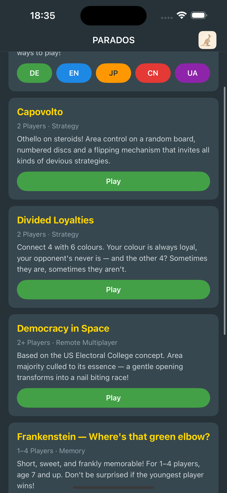
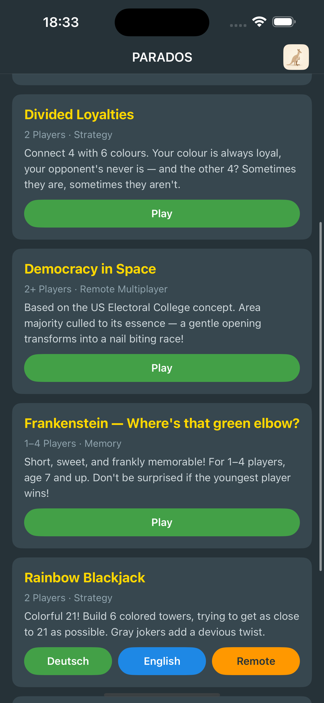
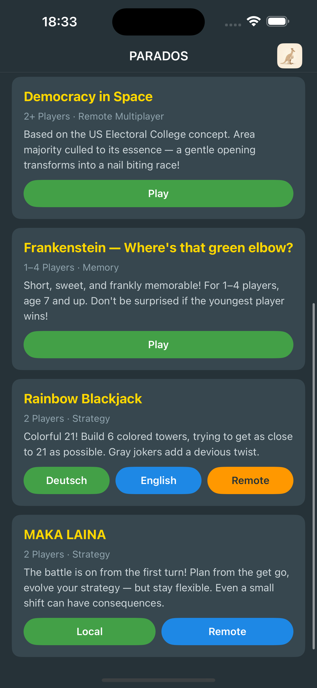
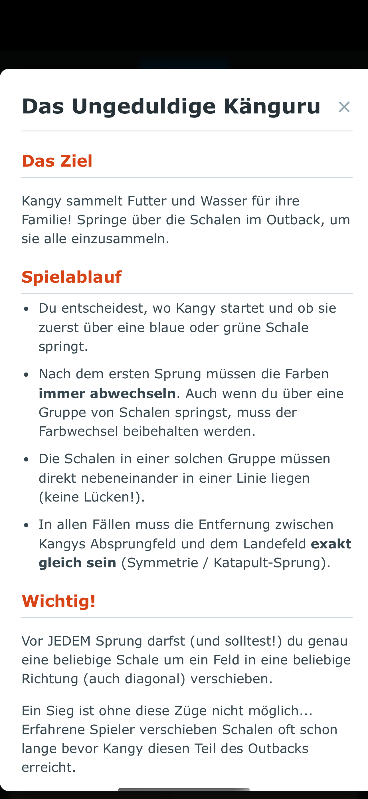
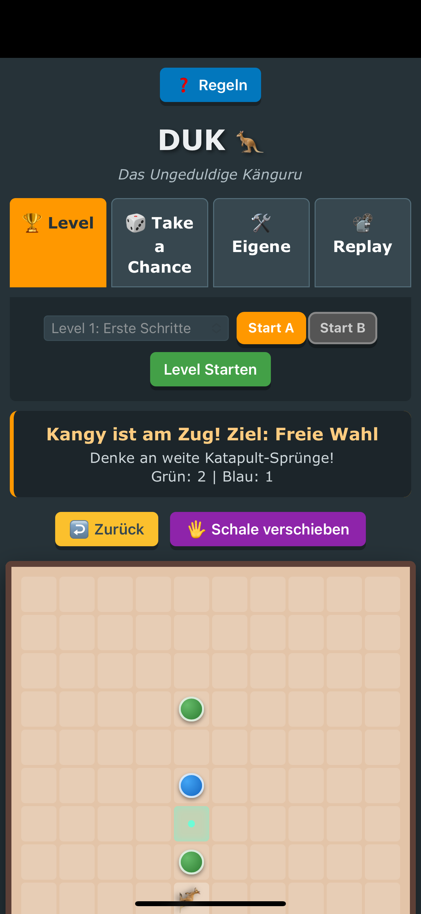
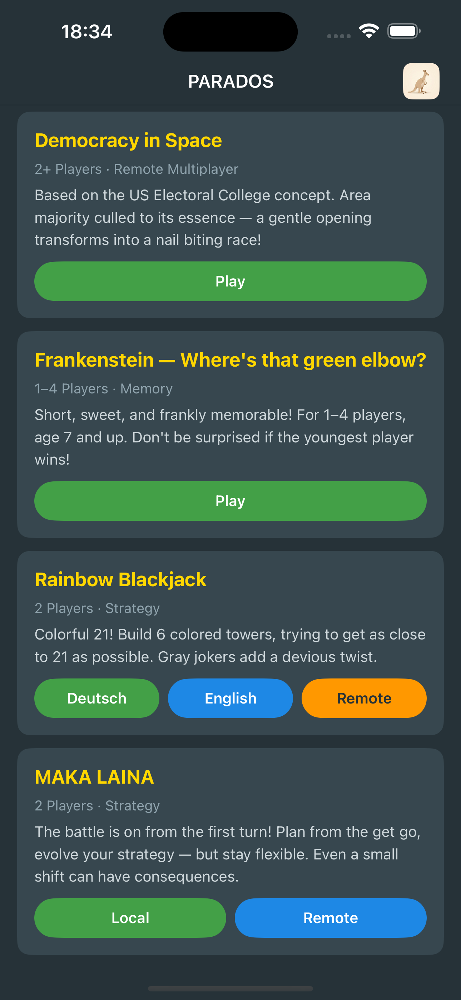
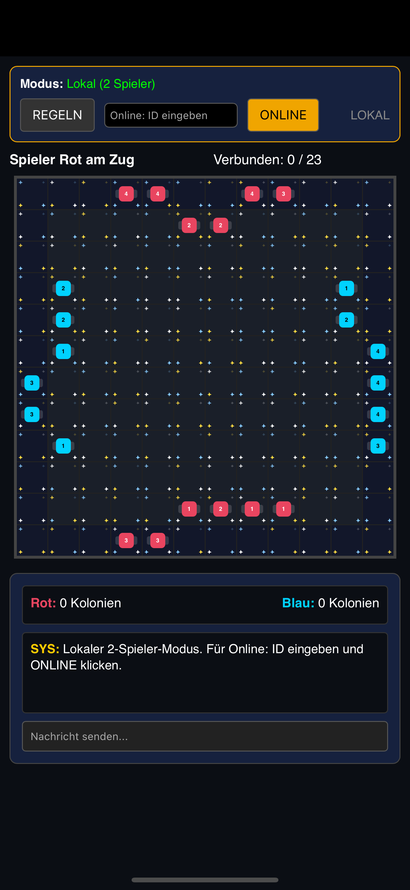
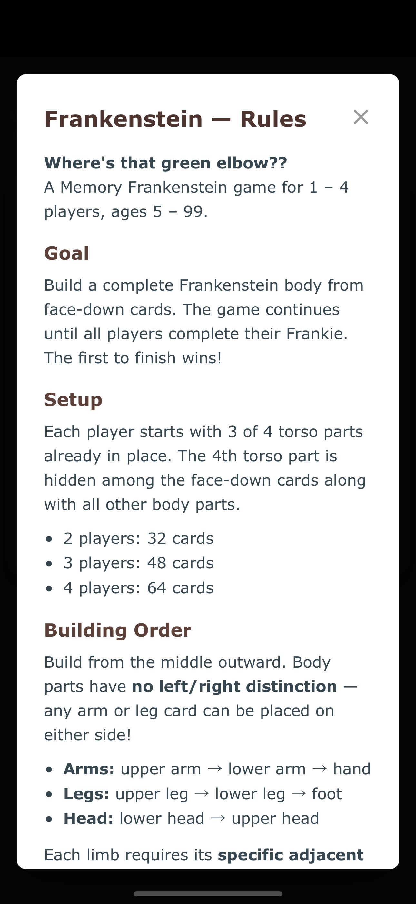
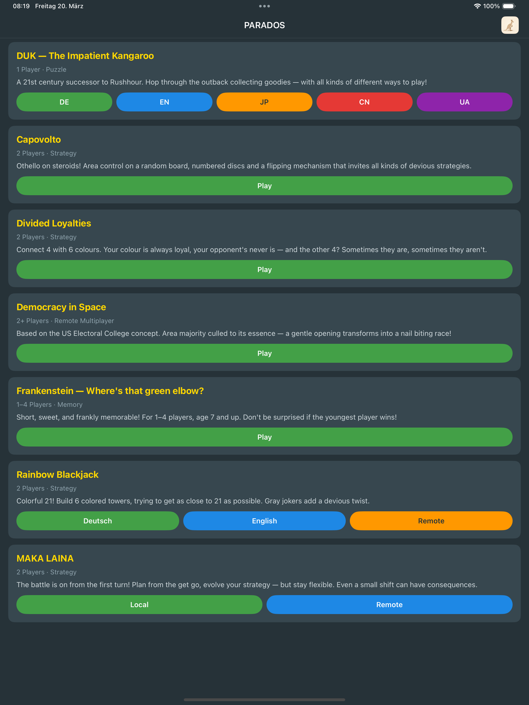

# Parados iOS

Parados Games for iOS — a collection of HTML/JavaScript board games in a native SwiftUI shell.

## Games

- **DUK — The Impatient Kangaroo** (1 Player, Puzzle) — DE, EN, JP, CN, UA
- **Capovolto** (2 Players, Strategy)
- **Divided Loyalties** (2 Players, Strategy)
- **Democracy in Space** (2+ Players, Strategy) — Play, Remote
- **Frankenstein — Where's that green elbow?** (1–4 Players, Memory)
- **Rainbow Blackjack** (2 Players, Strategy) — Deutsch, English, Remote
- **MAKA LAINA** (2 Players, Strategy) — Play, Remote

Remote multiplayer variants open in Safari for cross-device play.

## Screenshots

| Game List (top) | Game List (bottom) | MAKA LAINA |
|---|---|---|
|  |  |  |

| Kangaroo | Kangaroo Game | Capovolto |
|---|---|---|
|  |  |  |

| Frankenstein | Frankenstein Game | Rainbow Blackjack |
|---|---|---|
|  |  |  |

| iPad Game List |
|---|
|  |

## Requirements

- iOS 16.0+
- Xcode 15+
- [XcodeGen](https://github.com/yonaskolb/XcodeGen) (for project generation)

## Build

```bash
xcodegen generate
open Parados.xcodeproj
```

## License

[GPLv3](LICENSE)
